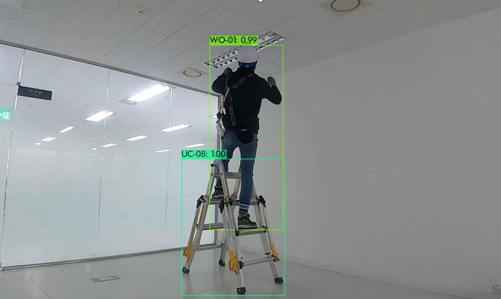

### 1. Project Overview (README.md)
```
Title: Darknet YOLOv4 Applied to Large-Scale Construction Portfolio

At Conti Lab, Chung Ang University, I implemented Darknet YOLOv4 in collaboration with the National Information Society Agency (NIA). The project involved over 110,000 construction-related images (458 GB). This repository serves as a demo portfolio showcasing the development and application of Darknet YOLOv4 for the construction domain.

Stack: Docker, YOLOv4, Python, PyTorch/Darknet, GitHub Actions

Key Features:

1. Data preprocessing (augmentation, formatting to YOLO format).

2. Training with YOLOv4.

3. Evaluation (mAP, precision, recall, F1-score).

4. Containerized environment with Docker.

5. Automated CI/CD pipeline for build, test, and deploy.
```
### 2. Repository Structure

```text
yolov4-cicd-portfolio/
│── data/                  # Example dataset or instructions for downloading
│── src/
│   ├── preprocessing/      # Scripts for data cleaning & augmentation
│   ├── training/           # YOLOv4 training scripts
│   ├── evaluation/         # Scripts to evaluate mAP, precision, recall
│── docker/
│   ├── Dockerfile          # Container definition
│   └── docker-compose.yml  # For local testing
│── .github/workflows/      # GitHub Actions CI/CD configs
│── requirements.txt        # Python dependencies
│── README.md               # Project overview & usage
│── Makefile                # One-command build/run workflow
```

### 3. CI/CD Pipeline (GitHub Actions)
```
Add a workflow file: .github/workflows/cicd.yml
```
### Pipeline Stages

#### 1.Build Stage

    Build Docker image.

    1. Install dependencies.

    2. Lint Python code (flake8, black).

#### 2. Test Stage
    
    1. Run unit tests for preprocessing scripts.
    
    2. Run evaluation to check outputs.
<p align="center">  <br> <em>Real-time ladder detection test image</em> </p>

#### 3. Push Stage

    1. Push Docker image to DockerHub GitHub Container Registry.

#### 4. Deploy

    1. Deploy model as REST API (FastAPI + Docker).

#### 5.License

    MIT License © 2025
---
👉 This version:
- Uses **relative path (`docs/ladder_real_time_image.jpg`)** so the image works directly in GitHub.  
- Centers and scales the image nicely.  
- Adds captions for clarity.  
- Organizes sections with professional spacing and formatting.  


